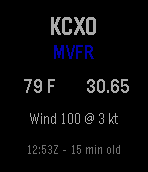
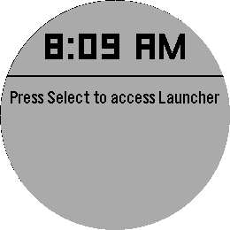
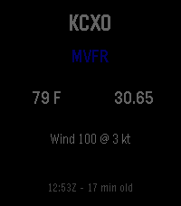
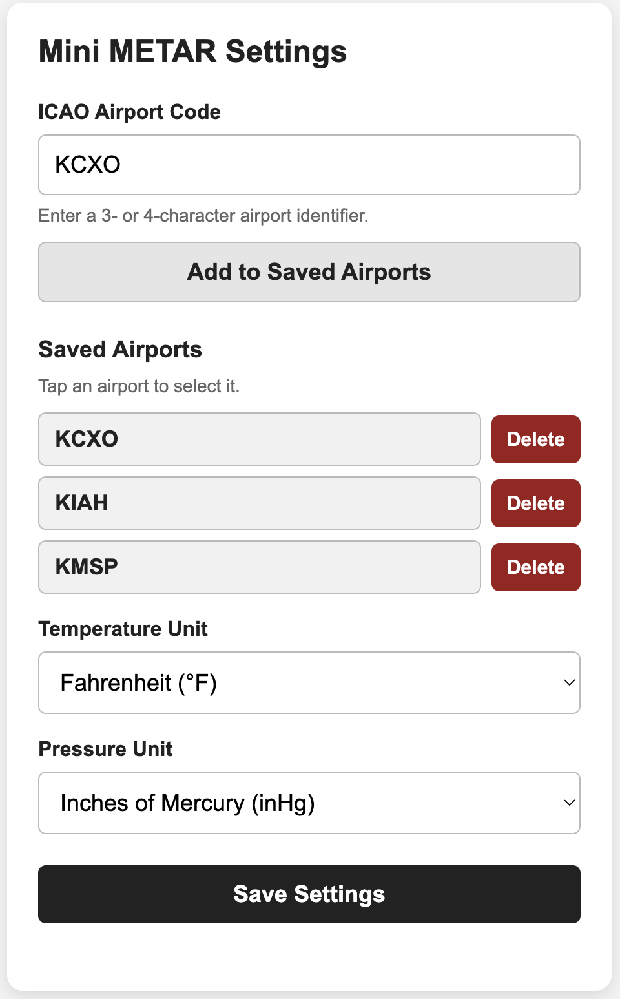

# Mini METAR for Pebble

A Pebble watch app that displays current METAR weather for a configurable airport.

The watch requests weather through PebbleKit JS, which calls a lightweight Flask API and sends the result back to the watch using AppMessage.

## Screenshots

<table>
  <tr>
    <th>Pebble Time</th>
    <th>Pebble Round 2</th>
    <th>Pebble Time 2</th>
  </tr>
  <tr>
    <td align="center"></td>
    <td align="center"></td>
    <td align="center"></td>
  </tr>
</table>

### Configuration page



## Why this project?

Mini METAR was created to provide pilots and aviation enthusiasts with a fast, glanceable weather display on Pebble smartwatches. It retrieves current METAR observations through a lightweight Flask API and presents the most important weather information in a format optimized for Pebble displays.

## Features

- Live METAR weather for any supported airport identifier
- Configurable airport through the Pebble configuration page
- Save up to 10 frequently used airports for quick selection
- Displays:
  - Flight category: VFR, MVFR, IFR, or LIFR
  - Temperature in Fahrenheit or Celsius
  - Altimeter setting in inHg or hPa
  - Wind direction and speed in knots
  - METAR observation time and age
- Automatic refresh every 5 minutes
- Manual refresh from the watch
- Color-coded flight category on color Pebble watches
- Responsive layouts for rectangular and round Pebble displays
- Offline indication when weather cannot be retrieved

## Supported platforms

The project currently builds for:

- `basalt` — Pebble Time
- `gabbro` — Pebble Round 2
- `emery` — Pebble Time 2

## Architecture

```text
Pebble watch
    ⇅ AppMessage
PebbleKit JavaScript
    ⇅ HTTPS
Flask METAR API
    ⇅
AviationWeather.gov
```

The watch-side application is written in C. The phone-side integration is written in JavaScript using PebbleKit JS.

## Project structure

```text
src/c/mini-metar-pebble.c       Application entry point
src/c/app_message/              AppMessage communication
src/c/formatter/                Temperature, pressure, wind, and time formatting
src/c/weather/                  Weather state and display coordination
src/c/windows/                  Pebble user interface
src/pkjs/index.js               Phone-side METAR retrieval and settings
mini-metar-config.html          Web-based configuration page
package.json                    App metadata, platforms, and message keys
wscript                         Pebble SDK build configuration
```

## Configuration

The companion configuration page allows the user to configure the app without rebuilding it.

Available options include:

- Airport identifier, such as `KCXO`
- Temperature units: Fahrenheit or Celsius
- Pressure units: inHg or hPa
- Saved Airports list for quick selection

Saved Airports are stored locally on the connected phone. Users can save up to 10 airports, tap one to select it, or remove airports they no longer need.

After the user presses **Save Settings**, PebbleKit JS stores the selected settings, requests fresh METAR data, and sends the updated weather to the watch.

Configuration page:

<https://jasonmarquette.com/pebble/mini-metar-config.html>

## Building

Install and configure the Pebble SDK, then run:

```bash
pebble build
```

A successful build creates:

```text
build/mini-metar-pebble.pbw
```

## Running in an emulator

Pebble Time:

```bash
pebble install --emulator basalt
```

Pebble Round 2:

```bash
pebble install --emulator gabbro
```

Pebble Time 2:

```bash
pebble install --emulator emery
```

To open the app configuration page while testing in the emulator:

```bash
pebble emu-app-config
```

## Installing on a watch

With a compatible phone and Pebble development connection available:

```bash
pebble install --phone <phone-ip-address>
```

## Weather data

The app currently retrieves METAR data through:

```text
https://jasonmarquette.com/api/metar
```

The API retrieves aviation weather data from AviationWeather.gov and returns a compact JSON response designed for the Pebble app.

Routine METAR observations are commonly issued approximately once per hour, so the displayed observation may be several minutes old even when the app has just refreshed.

## Development status

Current features include:

- ✅ Live METAR retrieval
- ✅ Configurable airport
- ✅ Saved Airports
- ✅ Fahrenheit and Celsius
- ✅ inHg and hPa
- ✅ Manual refresh
- ✅ Automatic 5-minute refresh
- ✅ Flight-category colors
- ✅ Observation time and age
- ✅ Offline indication
- ✅ Responsive layouts
- ✅ Basalt, Gabbro, and Emery support

Potential future enhancements include:

- Raw METAR text display
- Additional weather fields such as visibility, ceiling, and dew point
- Better indication of unusually old observations
- Additional weather providers as fallbacks

## Pebble SDK documentation

Pebble SDK documentation and resources are available at:

<https://developer.repebble.com>
